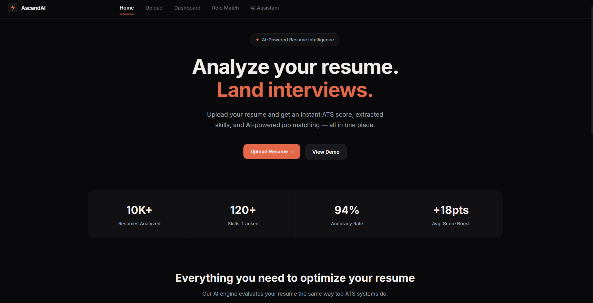
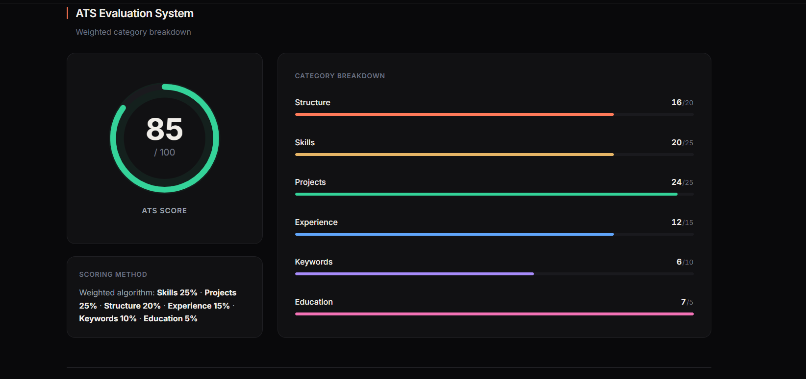
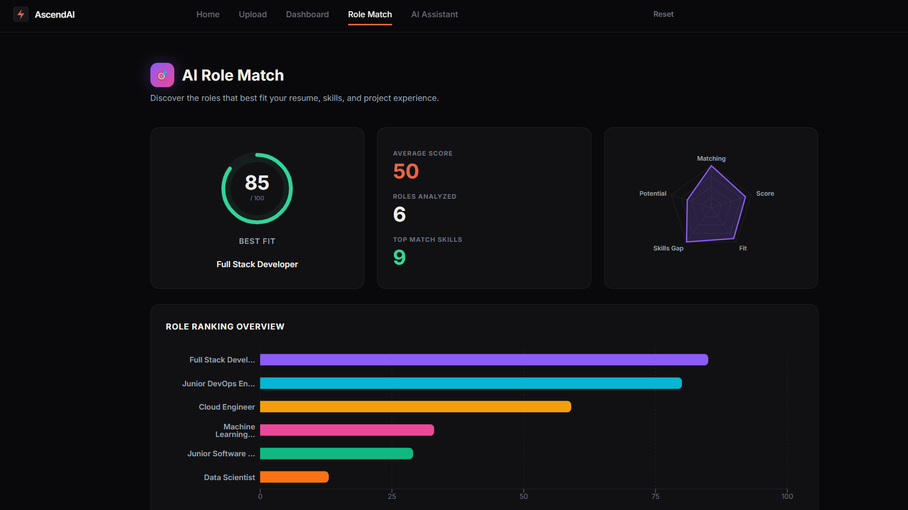
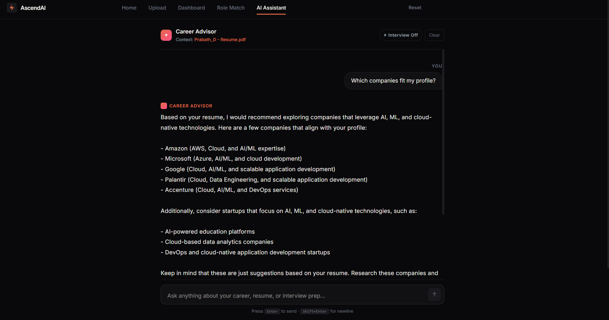

# 🚀 AscendAI - Resume Intelligence & Career Guidance Platform

AscendAI is a full-stack AI-powered resume intelligence platform that analyzes resumes, generates ATS scores, extracts technical skills, performs AI-based role matching, and provides resume-aware career guidance through an interactive AI assistant.

The project is designed as a production-oriented engineering system using a React frontend, FastAPI backend, Groq-powered LLM orchestration, PostgreSQL persistence, Redis caching, and Qdrant-based vector infrastructure.

---

## 🧠 Project Overview

AscendAI helps users understand how their resume performs from a recruiter and ATS perspective.

The platform supports:

* Resume upload and parsing
* ATS score generation
* Skill extraction
* Resume semantic intelligence
* AI role matching
* Job description matching
* Recruiter-style feedback
* Career guidance chatbot
* Interview preparation assistant
* Resume-aware conversational memory

---

## 🏗️ System Architecture

```text
User
 │
 ▼
React Frontend
 │
 ▼
FastAPI Backend
 │
 ├── Resume Parser
 ├── ATS Scoring Engine
 ├── AI Orchestrator
 ├── Role Matching Service
 ├── Chat Assistant
 ├── Redis Cache
 ├── PostgreSQL Database
 └── Qdrant Vector Store
```

---

<details>
<summary><h2>⚙️ Tech Stack</h2></summary>

### 🎨 Frontend
- React.js
- Vite
- Tailwind CSS
- Framer Motion
- Axios
- React Router
- Recharts

### 🧩 Backend
- FastAPI
- Python
- Async APIs
- Pydantic
- SQLAlchemy
- PyMuPDF
- python-docx

### 🤖 AI & NLP
- Groq API
- Llama 3.1 8B Instant
- Prompt Engineering
- Resume Semantic Analysis
- Structured JSON Extraction

### 🗄️ Database & Infrastructure
- Supabase PostgreSQL
- Redis Cache
- Qdrant Vector Database
- SHA256 Resume Hashing
- Docker Compose

### ☁️ Cloud & Deployment
- Vercel
- Render
- UptimeRobot

</details>

---

## 🔁 Technical Workflow

```text
Resume Upload
    ↓
File Validation
    ↓
Text Extraction
    ↓
Resume Hashing
    ↓
Redis Cache Lookup
    ↓
AI Resume Intelligence Pipeline
    ↓
ATS Score Generation
    ↓
Skill Extraction
    ↓
Role Matching
    ↓
Database Persistence
    ↓
Frontend Result Display
```

---

## 📊 Core Features

### 📝 Resume ATS Analysis

AscendAI evaluates the resume based on structure, skills, projects, experience, keywords, readability, and recruiter relevance.

### 🧠 Resume Semantic Intelligence

The system extracts deeper resume meaning such as candidate domain, project strength, technical depth, career alignment, and hiring confidence.

### 🎯 AI Role Matching

The platform generates realistic role matches using resume intelligence, extracted skills, missing skills, and recruiter-style reasoning.

### 💬 Career Guidance AI Assistant

Users can chat with an AI assistant that understands the uploaded resume and gives career guidance, improvement suggestions, and interview preparation support.

### 🧪 Job Description Matching

The project includes a JD matcher that compares resume text with job descriptions using TF-IDF and cosine similarity.

### ⚡ Redis Caching

Redis is used to cache resume analysis and reduce repeated AI processing for the same uploaded resume.

### 🧬 Vector Database Support

Qdrant is configured as the vector database layer for future semantic retrieval and resume-aware search workflows.

---

<details>
<summary><h2>📁 Project Folder Structure</h2></summary>

```text
Resume-AI-Platform/
│
├── backend/
│   ├── api/
│   │   └── chat/
│   ├── database/
│   │   ├── postgres.py
│   │   ├── qdrant.py
│   │   └── redis.py
│   ├── models/
│   ├── parsers/
│   ├── prompts/
│   ├── routes/
│   ├── schemas/
│   ├── services/
│   ├── uploads/
│   ├── utils/
│   ├── main.py
│   ├── Dockerfile
│   └── requirements.txt
│
├── frontend/
│   ├── public/
│   ├── src/
│   │   ├── components/
│   │   ├── context/
│   │   ├── layouts/
│   │   ├── pages/
│   │   ├── routes/
│   │   └── services/
│   ├── package.json
│   └── vite.config.js
│
├── docs/
│   ├── dashboard.png
│   ├── resume-analysis.png
│   ├── role-matching.png
│   └── career-assistant.png
│
├── docker-compose.yml
├── vercel.json
└── README.md
```
---

## 🔌 API Architecture

### Resume APIs

```text
POST   /api/v1/analyze-resume
GET    /api/v1/history
GET    /api/v1/{file_hash}
POST   /api/v1/job-match
POST   /api/v1/job-match/auto
```

### Chat APIs

```text
POST   /api/v1/chat/message
POST   /api/v1/chat/interview
GET    /api/v1/chat/history
DELETE /api/v1/chat/history
```

---

## 🖼️ Screenshots

### 🏠 Dashboard



---

### 📄 Resume Analysis



---

### 🎯 Role Matching



---

### 💬 Career Assistant



---

## 🚀 Deployment Architecture

```text
Frontend
React + Vite
Deployed on Vercel
        ↓
Backend API
FastAPI
Deployed on Render
        ↓
External Services
Supabase PostgreSQL
Redis
Qdrant
Groq API
```

---

## 🧪 Local Installation

### Backend

```bash
cd backend
pip install -r requirements.txt
uvicorn main:app --reload
```

### Frontend

```bash
cd frontend
npm install
npm run dev
```

---

## 🔐 Environment Variables

### Backend

```env
GROQ_API_KEY=
DATABASE_URL=
REDIS_URL=
QDRANT_URL=
```

### Frontend

```env
VITE_API_URL=
```

---

## 🐳 Docker Setup

```bash
docker-compose up --build
```

Recommended cleanup before production:

* Rename Docker containers from `elevora_*` to `ascendai_*`
* Replace `GEMINI_API_KEY` with `GROQ_API_KEY`
* Update database name from `elevora` to `ascendai`

---

## 🛠️ Engineering Highlights

* Async FastAPI backend
* Resume hashing for deduplication
* PostgreSQL persistence
* Redis-based cache layer
* Qdrant vector database integration
* AI response sanitization
* Structured JSON validation
* Retry and fallback handling
* Resume-aware AI chat assistant
* Job description similarity matching
* Modular service-based backend structure

---

## 📌 Future Improvements

* Add GitHub Actions CI/CD
* Add unit and integration tests
* Add Docker production profile
* Add centralized logging
* Add API rate limiting middleware
* Add authentication
* Add user dashboard
* Add resume version history
* Add OpenTelemetry tracing
* Add Prometheus + Grafana monitoring
* Add complete RAG pipeline using Qdrant
* Add model fallback chain
* Add background queue for resume processing

---

## 📄 License

This project is intended for educational, portfolio, and engineering demonstration purposes.
